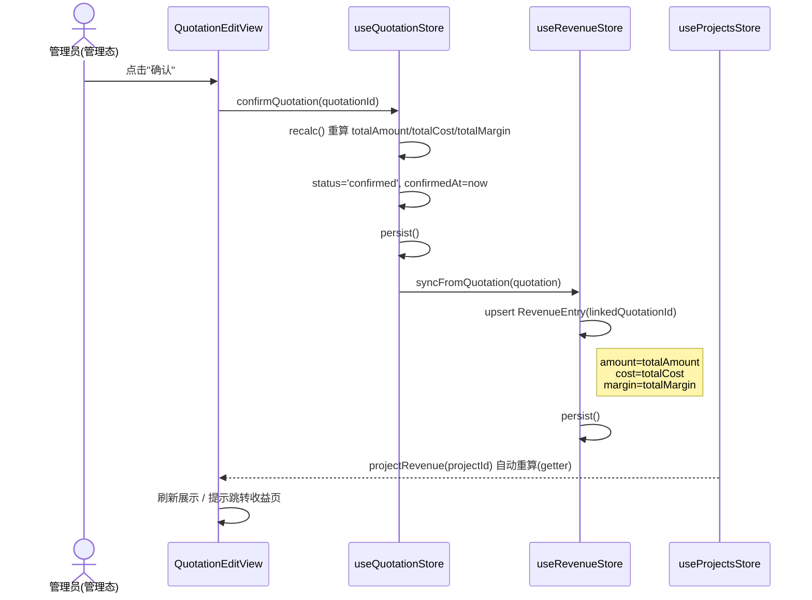
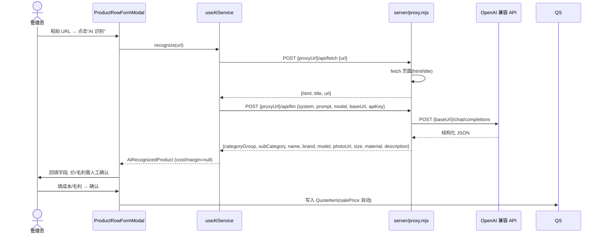
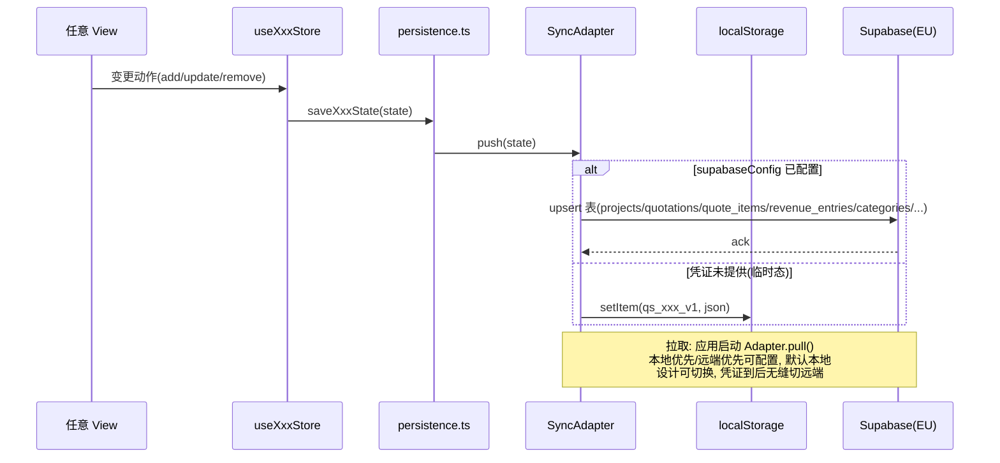
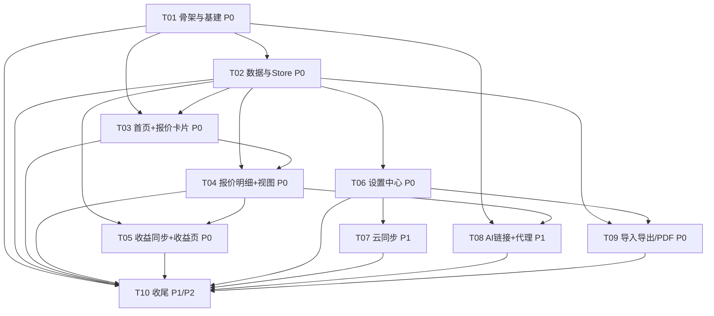

# 架构设计 & 任务分解 · Quote Studio PWA

> 文档作者：软件架构师（高见远）　|　状态：MVP 设计定稿　|　语言：中文
> 适用项目：`E:\955_WorkSpace\quote-studio/`　|　复用脚手架：`E:\955_WorkSpace\app/`（模块式结构）
> 关联文档：`docs/PRD.md`（v0.1）

---

## 1. 技术栈确认 & 关键约束

### 1.1 技术栈（沿用脚手架，零分歧）

| 维度 | 选型 | 说明 |
|------|------|------|
| 构建 | Vite 6 + `vite-plugin-pwa` + `vite-plugin-singlefile` | 普通构建出多文件 PWA；`--mode single` 出单文件 HTML |
| 框架 | Vue 3.5（`<script setup>` + TS `strict`） | 单文件组件 `.vue` |
| 状态 | Pinia 2 | 每模块独立 store + `persistence.ts` 守卫 |
| 路由 | vue-router 4（**hash 模式**） | 保证 `file://` 双击 / 静态托管 / Capacitor 三场景无需服务端 fallback |
| 样式 | Tailwind 3 + PostCSS + autoprefixer | `content` 扫描 `index.html` + `src/**/*.{vue,ts}` |
| 包管理 | npm（`"type": "module"`） | 与脚手架一致 |
| 云后端（P1） | `@supabase/supabase-js`（EU 区域） | 凭证未到前用 localStorage 临时态，设计可切换 |
| 表格（P0） | `xlsx`（SheetJS） | Excel 导入/导出 |
| 测试 | vitest + `@vue/test-utils` + `jsdom` | 含 `*.spec.ts` |

### 1.2 关键构建约束（来自任务要求，已对齐脚手架行为）

1. **`emptyOutDir: false` + prebuild 清理**
   - `vite.config.ts` 中 `build.emptyOutDir = false`（注释说明：E:\ 盘 safe-delete 会拦截 `rm`，不能交给 Vite 自动清）。
   - 新增 `scripts/clean.mjs`（`E:\` 盘 safe-delete shim）：递归删除项目内的 `dist/` 与 `dist-single/`，带**路径护栏**（仅允许删除项目根下名为 `dist`/`dist-single` 的目录，拒绝越界删除）。
   - `package.json` 脚本在 `build` / `build:single` / `build:all` 前显式 `npm run prebuild`（不依赖 npm 自动 `prebuild` hook，以保证 `build:single`/`build:all` 也清理）。

2. **`vite-plugin-singlefile` 仅 `--mode single`**
   - `vite.config.ts` 按 `mode === 'single'` 条件装载 `viteSingleFile()`，输出到 `dist-single/`（`assetsInlineLimit` 拉满、`cssCodeSplit:false`）。
   - 普通 `vite build` **不**装载 singlefile 插件。

3. **`VitePWA` 仅普通构建**
   - 仅当 `mode !== 'single'` 时装载 `VitePWA`，输出到 `dist/`（含 manifest + Workbox 缓存，图标走运行时 `CacheFirst`）。
   - 单文件构建不需要 Service Worker（已自包含），故关闭。

4. **`server/proxy.mjs` 为本地零依赖 Node 代理，不参与前端打包**
   - 仅用 Node 内置模块（`http`/`https`/`url`/`crypto`），**不引入任何 npm 依赖**，Node 20+ 用全局 `fetch` 抓页与调 LLM。
   - 经 `npm run proxy` 独立启动（默认端口 8787，可用 `PORT` 环境变量覆盖）；前端通过可配置的 `proxyUrl`（默认 `http://localhost:8787`）访问 `/api/health`、`/api/fetch`、`/api/llm`。
   - **绝不被 `vite build` 打包或 import**，仅运行时被浏览器fetch。

5. **脚本镜像脚手架 + 扩展**：`dev` / `build` / `build:single` / `build:all` / `preview` / `typecheck` / `test` 全部保留，并新增 `proxy` 与 `prebuild`（clean）。

---

## 2. 完整文件树（含每个文件用途）

```
quote-studio/
├─ package.json                         # 依赖与脚本(镜像 app + 新增 proxy/prebuild)；engines node>=20.19 <23
├─ vite.config.ts                       # 按 mode 切换 singlefile/PWA；emptyOutDir:false；alias @→src；test jsdom
├─ tsconfig.json                        # strict；paths @/*→src/*；include src/**/*.{ts,d.ts,vue} + vite.config.ts
├─ tailwind.config.js                   # content 扫描；沿用 coral/ink/paper 主题色（报价工作台可微调）
├─ postcss.config.js                    # tailwindcss + autoprefixer
├─ index.html                           # lang=zh-CN；theme-color；PWA 图标；<div id="app">
├─ .gitignore                           # node_modules/ dist/ dist-single/ .vite/ *.local
├─ vercel.json                          # (可选) 部署 parity，非必须
├─ server/
│  └─ proxy.mjs                         # 零依赖 Node 代理：/api/health, /api/fetch, /api/llm（AI 链接用）
├─ scripts/
│  └─ clean.mjs                         # E:\ 盘 safe-delete shim：清理 dist/ 与 dist-single/（带路径护栏）
├─ public/
│  ├─ favicon.ico
│  └─ icons/icon-192.png, icon-512.png # PWA 图标（需生成，见待明确事项）
├─ src/
│  ├─ main.ts                           # createApp + pinia + router + styles/tailwind.css
│  ├─ App.vue                           # 外壳：顶栏 + 抽屉导航 + 撤销条 + RouterView + PwaUpdatePrompt + DataModal
│  ├─ router/
│  │  └─ index.ts                       # hash 路由；拼接四模块 routes + Home + catch-all
│  ├─ styles/
│  │  └─ tailwind.css                   # @tailwind base/components/utilities + 打印样式(@media print, PDF 用)
│  ├─ shared/
│  │  ├─ nav.ts                         # 顶层导航(对标 scaffold sections.ts)：home/projects/quotation/settings + 图标
│  │  ├─ icons.ts                       # 内联 SVG 图标集(复用并补充：home/wallet/briefcase/settings/sparkles…)
│  │  ├─ format.ts                      # formatEUR()=Intl.NumberFormat('es-ES',{EUR})；日期/数字统一格式化
│  │  ├─ composables/
│  │  │  ├─ use-undo.ts                 # 撤销（复用脚手架）
│  │  │  └─ use-currency.ts             # 货币/标签上下文(读 settings.currency/language)
│  │  └─ components/
│  │     ├─ BaseModal.vue               # 通用弹窗（复用）
│  │     ├─ PwaUpdatePrompt.vue         # PWA 更新提示（复用）
│  │     ├─ SearchInput.vue             # 搜索框（复用）
│  │     └─ DataModal.vue               # 导入/导出(JSON/Excel) 入口（跨模块，挂在 App 外壳）
│  └─ modules/
│     ├─ revenue/                       # ★ 项目收益聚合根 + 收益记录
│     │  ├─ index.ts                    # 对外 API：useProjectsStore/useRevenueStore + routes + 常量 + 类型
│     │  ├─ routes.ts                   # /projects(name:projects) , /projects/:id(name:project-detail)
│     │  ├─ types.ts                    # Project, RevenueEntry, ProjectRevenueSummary, 枚举
│     │  ├─ constants.ts                # 默认分类(大类/小类)种子、REVENUE_DB_KEY、状态枚举
│     │  ├─ store/
│     │  │  ├─ revenue-store.ts         # useProjectsStore(项目CRUD+收益聚合getter) / useRevenueStore(RevenueEntry upsert+聚合)
│     │  │  └─ persistence.ts           # normalizeProject/normalizeRevenueEntry + load/save（独立 key）
│     │  ├─ views/
│     │  │  ├─ ProjectsListView.vue     # 项目卡片网格(总收益/总利润/状态)
│     │  │  └─ ProjectDetailView.vue    # 项目详情 + 收益概览(按时间/来源)
│     │  └─ components/
│     │     ├─ ProjectCard.vue          # 单项目卡(金额/状态/操作)
│     │     └─ RevenueSummary.vue       # 收益汇总块(销售额/成本/利润)
│     ├─ quotation/                     # ★ 报价系统（管理态/客户视图）
│     │  ├─ index.ts                    # 对外 API：useQuotationStore + routes + 常量 + 类型
│     │  ├─ routes.ts                   # /quotation(name:quotation) , /quotation/:projectId(name:quotation-edit)
│     │  ├─ types.ts                    # Quotation, QuoteItem, QuotationStatus
│     │  ├─ constants.ts                # QUOTATION_DB_KEY、字段默认、客户视图可见字段白名单
│     │  ├─ store/
│     │  │  ├─ quotation-store.ts       # useQuotationStore(报价+行 CRUD；confirm→触发收益同步)
│     │  │  └─ persistence.ts           # normalizeQuotation/normalizeQuoteItem + load/save
│     │  ├─ views/
│     │  │  ├─ QuotationGridView.vue    # 项目卡片网格(筛选/搜索/自定义分类) → 进入报价
│     │  │  └─ QuotationEditView.vue    # 报价编辑(管理态默认；客户视图开关；确认按钮)
│     │  └─ components/
│     │     ├─ CategorySection.vue      # 大类→小类 分组区块
│     │     ├─ QuoteItemRow.vue         # 产品行(成本/毛利/内部备注仅在管理态)
│     │     ├─ QuotationSummaryBar.vue  # 整单汇总条(totalAmount/totalCost/totalMargin)
│     │     ├─ ProductRowFormModal.vue  # 新增/编辑产品行(含 AI 识别入口)
│     │     └─ CustomerViewToggle.vue   # 管理态⇄客户视图 只读切换
│     ├─ settings/                      # ★ 设置中心(独立页)
│     │  ├─ index.ts                    # 对外 API：useSettingsStore + routes + 常量 + 类型
│     │  ├─ routes.ts                   # /settings(name:settings)
│     │  ├─ types.ts                    # Settings, CompanyProfile, PdfTemplate, SupabaseConfig, OpenaiConfig
│     │  ├─ constants.ts                # SETTINGS_DB_KEY、默认 PDF 模板、默认设置
│     │  ├─ store/
│     │  │  ├─ settings-store.ts        # useSettingsStore(设置/公司资料/分类集中管理)
│     │  │  └─ persistence.ts           # normalizeSettings/normalizeCompanyProfile/normalizeCategory* + load/save
│     │  ├─ views/
│     │  │  └─ SettingsCenterView.vue    # Tab 式设置中心容器
│     │  └─ components/
│     │     ├─ CategoryManager.vue      # 大类/小类 增删改排序(全局唯一)
│     │     ├─ CompanyProfileForm.vue   # 公司资料(Logo/名称/地址/税号/页脚)
│     │     ├─ PdfTemplateSettings.vue  # PDF 页眉布局/是否显示 Logo
│     │     ├─ SyncSettings.vue         # 云同步配置(Supabase URL/anonKey 占位)
│     │     └─ AiSettings.vue           # OpenAI 兼容配置(baseUrl/apiKey/model)
│     └─ ai-link/                       # ★ AI 链接识别(P1)
│        ├─ index.ts                    # 对外 API：useAIService + 类型(无独立路由)
│        ├─ routes.ts                   # aiLinkRoutes: RouteRecordRaw[] = [] (模态服务, 无顶层页)
│        ├─ types.ts                    # AiRecognizedProduct, AiLinkConfig
│        ├─ store/
│        │  └─ ai-service.ts            # useAIService(调用 proxy /api/fetch+/api/llm；价/毛利留空)
│        └─ components/
│           └─ AiLinkModal.vue          # 粘贴 URL→识别→回填(供 ProductRowFormModal 调用)
```

> **模块对外经 `index.ts` 暴露**：任何跨模块引用（如 `quotation` 调用 `revenue` 的 store、`ai-link` 被 `quotation` 引用）一律 `import { ... } from '@/modules/<module>'`，禁止穿透到内部 `store/*`、`types.ts` 等路径。

---

## 3. TypeScript Interface 草案（对齐 PRD §5 + §7 强约束）

### 3.1 数据实体

```ts
// ===== 通用枚举 / 别名 =====
export type CurrencyCode = 'EUR';                 // MVP 仅 EUR；多币种列为 P2
export type ProjectStatus = 'active' | 'completed' | 'archived';
export type QuotationStatus = 'draft' | 'confirmed';
export type LanguageCode = 'zh';

// ===== Project（项目·收益聚合根）=====
export interface Project {
  id: string;                 // 自增或 crypto.randomUUID()
  name: string;
  clientName: string;
  address: string;
  status: ProjectStatus;
  currency: CurrencyCode;     // 默认 'EUR'
  coverUrl: string;           // 项目封面(可选)
  createdAt: string;          // ISO 8601
  updatedAt: string;
}

// ===== Quotation（报价单，MVP 每项目 1 单）=====
export interface Quotation {
  id: string;
  projectId: string;          // 关联 Project(聚合根)
  title: string;
  status: QuotationStatus;    // 'draft' | 'confirmed'
  confirmedAt: string | null; // 仅 confirmed 时有值
  totalAmount: number;        // = Σ lineTotal（自动汇总）
  totalCost: number;          // = Σ(cost*qty)（自动汇总）
  totalMargin: number;        // = Σ(margin*qty)（自动汇总）
  items: QuoteItem[];         // 内联产品行(MVP 简化; 亦可由 store 单独管理)
  createdAt: string;
  updatedAt: string;
}

// ===== QuoteItem（产品行）=====
export interface QuoteItem {
  id: string;
  quotationId: string;
  categoryGroupId: string;    // 引用全局 CategoryGroup
  subCategoryId: string;      // 引用全局 SubCategory
  name: string;
  brand: string;
  model: string;
  photoUrl: string;
  customerNote: string;       // 客户可见
  internalNote: string;       // 仅管理员
  cost: number;               // 成本(管理员字段)
  margin: number;             // 毛利(人工录入, 管理员字段)
  salePrice: number;          // = cost + margin（系统自动, 见 §7 规则1）
  quantity: number;
  lineTotal: number;          // = salePrice * quantity（自动, 见 §7 规则2）
}

// ===== RevenueEntry（收益记录）=====
export interface RevenueEntry {
  id: string;
  projectId: string;
  source: string;             // 如 'quotation_confirmed'
  amount: number;             // 销售额 = Quotation.totalAmount
  cost: number;               // = Quotation.totalCost
  margin: number;             // 利润 = Quotation.totalMargin
  linkedQuotationId: string;  // 关联来源报价
  recordedAt: string;
}

// ===== 分类（全局唯一，设置中心集中管理）=====
export interface CategoryGroup {
  id: string;
  name: string;               // 中文标签
  nameEs: string;             // 西班牙文标签(双语)
  icon: string;               // 内联 SVG 或 emoji
  order: number;
}
export interface SubCategory {
  id: string;
  groupId: string;            // 归属 CategoryGroup
  name: string;
  nameEs: string;
  order: number;
}

// ===== CompanyProfile（公司资料·单例）=====
export interface CompanyProfile {
  id: 'company';              // 固定主键
  logoUrl: string;
  name: string;
  address: string;
  phone: string;
  email: string;
  taxId: string;
  footerNote: string;
}

// ===== Settings（设置·单例）=====
export interface SupabaseConfig { url: string; anonKey: string; }
export interface OpenaiConfig { baseUrl: string; apiKey: string; model: string; }
export interface PdfTemplate { headerLayout: 'logo-left' | 'logo-center' | 'none'; showLogo: boolean; }
export interface Settings {
  id: 'settings';             // 固定主键
  language: LanguageCode;     // 'zh'
  currency: CurrencyCode;     // 'EUR'
  supabaseConfig: SupabaseConfig | null;  // 凭证未到为 null
  openaiConfig: OpenaiConfig | null;      // 凭证未到为 null
  pdfTemplate: PdfTemplate;
}

// ===== 收益聚合视图(派生, 不持久化) =====
export interface ProjectRevenueSummary {
  projectId: string;
  totalSales: number;         // Σ RevenueEntry.amount
  totalCost: number;           // Σ RevenueEntry.cost
  totalProfit: number;        // Σ RevenueEntry.margin
  entryCount: number;
  lastRecordedAt: string | null;
}

// ===== AI 识别结果(价格/毛利留空, 见 §7 规则8) =====
export interface AiRecognizedProduct {
  url: string;
  categoryGroup: string;       // 建议大类名(映射到 CategoryGroup)
  subCategory: string;
  name: string;
  brand: string;
  model: string;
  photoUrl: string;
  size: string;
  material: string;
  description: string;
  cost: number | null;         // 留空 → 人工确认
  margin: number | null;       // 留空 → 人工确认
}
```

### 3.2 Pinia Store 形状

```ts
// revenue/store/revenue-store.ts
export const useProjectsStore = defineStore('projects', () => {
  const projects = ref<Project[]>([]);
  const nextId = ref(1);
  function addProject(p: Omit<Project,'id'|'createdAt'|'updatedAt'>): Project;
  function updateProject(id: string, patch: Partial<Project>): void;
  function removeProject(id: string): void;
  function getProject(id: string): Project | undefined;
  // getter：项目收益聚合(读取 useRevenueStore)
  const projectRevenue = (projectId: string): ProjectRevenueSummary;
  const portfolioSummary = computed((): ProjectRevenueSummary); // 全组合计
  return { projects, nextId, addProject, updateProject, removeProject, getProject, projectRevenue, portfolioSummary, hydrate, persist };
});

export const useRevenueStore = defineStore('revenue', () => {
  const entries = ref<RevenueEntry[]>([]);
  // 报价确认时调用：生成/刷新该项目一条 RevenueEntry
  function syncFromQuotation(q: Quotation): void;   // upsert by linkedQuotationId
  function removeByQuotation(quotationId: string): void;
  const byProject = (projectId: string): RevenueEntry[];
  return { entries, syncFromQuotation, removeByQuotation, byProject, hydrate, persist };
});

// quotation/store/quotation-store.ts
export const useQuotationStore = defineStore('quotation', () => {
  const quotations = ref<Quotation[]>([]);
  function getOrCreate(projectId: string): Quotation;        // MVP 每项目 1 单
  function addItem(qid: string, item: Omit<QuoteItem,'id'|'salePrice'|'lineTotal'>): void;
  function updateItem(qid: string, itemId: string, patch: Partial<QuoteItem>): void;
  function removeItem(qid: string, itemId: string): void;
  function recalc(q: Quotation): void;                        // 重算 salePrice/lineTotal/汇总
  // 强约束#4：仅"确认"触发收益同步
  function confirmQuotation(qid: string): void;              // status→confirmed → useRevenueStore.syncFromQuotation
  return { quotations, getOrCreate, addItem, updateItem, removeItem, recalc, confirmQuotation, hydrate, persist };
});

// settings/store/settings-store.ts
export const useSettingsStore = defineStore('settings', () => {
  const settings = ref<Settings>(/* 默认 */);
  const companyProfile = ref<CompanyProfile>(/* 默认 */);
  const categoryGroups = ref<CategoryGroup[]>([]);
  const subCategories = ref<SubCategory[]>([]);
  function updateSettings(patch: Partial<Settings>): void;
  function updateCompanyProfile(patch: Partial<CompanyProfile>): void;
  function addCategoryGroup/SubCategory, update*, remove* (含顺序调整);
  return { settings, companyProfile, categoryGroups, subCategories, ... , hydrate, persist };
});

// ai-link/store/ai-service.ts
export const useAIService = defineStore('ai-link', () => {
  const status = ref<'idle'|'fetching'|'parsing'|'done'|'error'>('idle');
  const error = ref<string|null>(null);
  // 经 server/proxy.mjs 调用，返回结构化字段(cost/margin 为 null)
  async function recognize(url: string): Promise<AiRecognizedProduct>;
  return { status, error, recognize };
});
```

### 3.3 PRD §7 强约束 → 设计落点（必读）

| 规则 | 落点 |
|------|------|
| 1 `salePrice=cost+margin` 自动；毛利人工录入，不反向推导成本 | `quotation-store.recalc()` 计算；`QuoteItemRow` 仅可编辑 `cost`/`margin`，`salePrice` 只读 |
| 2 `lineTotal=salePrice*qty` 自动 | `recalc()` |
| 3 `totalAmount/totalCost/totalMargin` 自动汇总 | `recalc()` 后写入 Quotation 汇总字段 |
| 4 确认即同步 RevenueEntry（仅"确认"触发） | `confirmQuotation()` → `useRevenueStore.syncFromQuotation()`；草稿编辑**不**调用 |
| 5 客户视图/PDF 剥离成本/毛利/内部备注 | `constants.ts` 维护 `CUSTOMER_VISIBLE_FIELDS` 白名单；`CustomerViewToggle`+PDF 打印样式仅渲染白名单字段 |
| 6 管理员字段隔离 | `cost/margin/internalNote` 在 `QuotationEditView` 管理态渲染，客户视图与导出路径一律不出现 |
| 7 分类全局唯一 | 分类仅由 `settings` 模块 `CategoryManager` 维护；`QuoteItem` 引用 `categoryGroupId/subCategoryId`，不内联创建 |
| 8 AI 不定价 | `AiRecognizedProduct.cost/margin` 为 `null`，回填表单后由人工填价再写 `QuoteItem` |

### 3.4 实体关系图（Mermaid classDiagram）

```mermaid
classDiagram
    class Project {
        +string id
        +string name
        +string clientName
        +string address
        +ProjectStatus status
        +CurrencyCode currency
        +string coverUrl
        +string createdAt
        +string updatedAt
    }
    class Quotation {
        +string id
        +string projectId
        +string title
        +QuotationStatus status
        +string confirmedAt
        +number totalAmount
        +number totalCost
        +number totalMargin
        +QuoteItem[] items
        +string createdAt
        +string updatedAt
    }
    class QuoteItem {
        +string id
        +string quotationId
        +string categoryGroupId
        +string subCategoryId
        +string name
        +string brand
        +string model
        +string photoUrl
        +string customerNote
        +string internalNote
        +number cost
        +number margin
        +number salePrice
        +number quantity
        +number lineTotal
    }
    class RevenueEntry {
        +string id
        +string projectId
        +string source
        +number amount
        +number cost
        +number margin
        +string linkedQuotationId
        +string recordedAt
    }
    class CategoryGroup {
        +string id
        +string name
        +string nameEs
        +string icon
        +number order
    }
    class SubCategory {
        +string id
        +string groupId
        +string name
        +string nameEs
        +number order
    }
    class CompanyProfile {
        +"company" id
        +string logoUrl
        +string name
        +string address
        +string phone
        +string email
        +string taxId
        +string footerNote
    }
    class Settings {
        +"settings" id
        +"zh" language
        +"EUR" currency
        +SupabaseConfig supabaseConfig
        +OpenaiConfig openaiConfig
        +PdfTemplate pdfTemplate
    }
    class SupabaseConfig { +string url +string anonKey }
    class OpenaiConfig { +string baseUrl +string apiKey +string model }
    class PdfTemplate { +headerLayout +boolean showLogo }
    class AiRecognizedProduct {
        +string url
        +string categoryGroup
        +string subCategory
        +string name
        +string brand
        +string model
        +string photoUrl
        +string size
        +string material
        +string description
        +number cost
        +number margin
    }

    Project "1" *-- "0..1" Quotation : owns(MVP 1:1)
    Project "1" *-- "0..n" RevenueEntry : aggregates
    Quotation "1" *-- "0..n" QuoteItem : contains
    QuoteItem "n" --> "1" CategoryGroup : references
    QuoteItem "n" --> "1" SubCategory : references
    SubCategory "n" --> "1" CategoryGroup : belongsTo
    RevenueEntry "n" --> "1" Quotation : linkedQuotationId
    Settings o-- SupabaseConfig
    Settings o-- OpenaiConfig
    Settings o-- PdfTemplate
```

---

## 4. 关键调用流程（时序）

### 4.1 报价确认 → 收益同步（强约束 #4）



### 4.2 AI 链接识别（P1，强约束 #8 价/毛利留空）



### 4.3 云同步（Supabase，P1，可切换临时态）



> **SyncAdapter 设计要点**：`persistence.ts` 的 `saveXxxState` 在写 localStorage 的同时，若 `useSettingsStore.settings.supabaseConfig` 非空，则经 `@supabase/supabase-js` 双写/订阅对应表。表结构：`projects` / `quotations` / `quote_items` / `revenue_entries` / `category_groups` / `sub_categories` / `company_profile`(单例) / `settings`(单例)。字段在同步边界做 camelCase↔snake_case 映射（`format.ts` 或 `persistence.ts` 内处理）。

---

## 5. 依赖包清单

**运行时依赖（dependencies）**

| 包 | 版本建议 | 用途 |
|----|----------|------|
| `vue` | ^3.5.13 | 框架 |
| `vue-router` | ^4.4.5 | hash 路由 |
| `pinia` | ^2.2.6 | 状态管理 |
| `@supabase/supabase-js` | ^2.x | P1 云同步（EU；凭证未到前不强制使用） |
| `xlsx` | ^0.18.x | P0 Excel 导入/导出（SheetJS） |

**仅开发依赖（devDependencies）**

| 包 | 版本建议 | 用途 |
|----|----------|------|
| `vite` | ^6.0.5 | 构建 |
| `@vitejs/plugin-vue` | ^5.2.1 | Vue SFC 编译 |
| `typescript` | ^5.6.3 | 类型 |
| `vue-tsc` | ^2.1.10 | 类型检查 |
| `vite-plugin-pwa` | ^0.21.1 | 普通构建 PWA |
| `vite-plugin-singlefile` | ^2.0.3 | `--mode single` 单文件 |
| `tailwindcss` | ^3.4.17 | 样式 |
| `postcss` | ^8.4.49 | 样式处理 |
| `autoprefixer` | ^10.4.20 | 样式前缀 |
| `@types/node` | ^22.20.1 | Node 类型（proxy/clean 脚本） |
| `vitest` | ^3.2.7 | 测试运行器 |
| `@vue/test-utils` | ^2.4.11 | 组件测试 |
| `jsdom` | ^25.0.1 | 测试 DOM 环境 |

> `server/proxy.mjs` 与 `scripts/clean.mjs` **不引入任何依赖**，仅用 Node 内置模块；`xlsx` 与 `@supabase/supabase-js` 为新增（脚手架无）。

---

## 6. 共享约定

1. **字段命名**：应用内统一 `camelCase`（TS 接口/JSON）；若 Supabase 表用 `snake_case`，仅在同步边界（`persistence.ts`/`SyncAdapter`）做映射，业务层不感知。
2. **货币/数字格式**：统一经 `shared/format.ts` 的 `formatEUR(n: number): string`，内部 `Intl.NumberFormat('es-ES', { style: 'currency', currency: 'EUR' })`。禁止在组件内手拼 `€`/写死格式。
3. **中/西标签集中**：分类、导航等双语标签集中在各模块 `constants.ts`（如 `name`/`nameEs`）；新增可见文案避免散落组件。图标集中在 `shared/icons.ts`（内联 SVG，不引图标库）。
4. **Store 持久化**：每个模块 `store/persistence.ts` 提供 `isRecord` + `normalizeXxx` 守卫（类型/范围校验、默认值兜底、字段截断）与 `load*/save*`（`storage` 默认 `localStorage`，可注入便于测试）；localStorage key 命名空间 `qs_<module>_v1`。
5. **模块边界**：跨模块一律经目标模块 `index.ts` 暴露的 API（store/routes/常量/类型）引用，禁止穿透内部路径。
6. **客户视图隔离**：`CUSTOMER_VISIBLE_FIELDS` 白名单（`quotation/constants.ts`）统管"客户视图 + 导出 PDF"的可见字段，任何新增管理员字段须在此显式排除。
7. **构建/运行模式**：普通 `build`→PWA 多文件；`build:single`→单文件 HTML；`proxy`→独立本地代理（不打包）。

---

## 7. 有序任务列表（实现顺序，含依赖）

> 规则：骨架先行 → 数据与 store → 各功能页 → 收尾；每个任务标注**涉及文件**与**依赖**。优先级 P0=上线门槛，P1=强烈建议。

### T01 · P0 项目骨架与基建
- **涉及**：`package.json`、`vite.config.ts`、`tsconfig.json`、`tailwind.config.js`、`postcss.config.js`、`index.html`、`.gitignore`、`server/proxy.mjs`（占位骨架）、`scripts/clean.mjs`、`public/`(图标/favicon)、`src/main.ts`、`src/App.vue`、`src/router/index.ts`、`src/styles/tailwind.css`、`src/shared/*`(`nav.ts`/`icons.ts`/`format.ts`/`composables/*`/`components/*`)。
- **依赖**：无。
- **产出**：可 `npm run dev` 启动空壳；`npm run proxy` 起代理；`build`/`build:single`/`build:all` 脚本可用（含 prebuild 清理）。

### T02 · P0 数据与 Store（四类实体 + 持久化 + 守卫）
- **涉及**：`revenue/{types,constants,store/revenue-store,store/persistence}`、`quotation/{types,constants,store/quotation-store,store/persistence}`、`settings/{types,constants,store/settings-store,store/persistence}`、`ai-link/{types,store/ai-service}`；并在 `persistence` 预留 `SyncAdapter` 接口（local/Supabase 可切换）。
- **依赖**：T01。
- **产出**：所有 store 可 `hydrate`/`persist`，强约束 #4 的 `confirmQuotation→syncFromQuotation`、#1/#2/#3 的 `recalc` 已实现并通过 `*.spec.ts`。

### T03 · P0 首页工作台 + 报价项目卡片网格
- **涉及**：`src/views/HomeView.vue`、`quotation/views/QuotationGridView.vue`、`quotation/components/ProjectCard.vue`（读 `useProjectsStore` + `useQuotationStore`）、`shared/nav.ts` 四入口接入 `App.vue` 抽屉。
- **依赖**：T02（store 可读）。
- **产出**：首页功能卡片网格（项目收益 / 报价两张，结构可扩展）；报价页项目卡片网格（金额/日期/筛选搜索）。

### T04 · P0 报价明细 + 管理态/客户视图
- **涉及**：`quotation/views/QuotationEditView.vue`、`quotation/components/{CategorySection,QuoteItemRow,QuotationSummaryBar,ProductRowFormModal,CustomerViewToggle}.vue`。
- **依赖**：T02、T03。
- **产出**：两级分类区块、产品行（成本/毛利/内部备注仅管理态）、整单汇总条、客户视图只读开关（白名单隔离）、确认按钮（触发 T02 的收益同步）。

### T05 · P0 收益同步 + 收益页
- **涉及**：`revenue/views/{ProjectsListView,ProjectDetailView}.vue`、`revenue/components/{ProjectCard,RevenueSummary}.vue`；收益同步逻辑由 T02 的 `useRevenueStore.syncFromQuotation` 提供，本任务负责展示与确认后流转。
- **依赖**：T02（revenue store）、T04（确认触发）。
- **产出**：项目卡片网格（总收益/总利润/状态）、项目详情收益概览；确认报价后看板即时更新。

### T06 · P0 设置中心（分类/公司/PDF）
- **涉及**：`settings/views/SettingsCenterView.vue`、`settings/components/{CategoryManager,CompanyProfileForm,PdfTemplateSettings}.vue`。
- **依赖**：T02（settings store）。
- **产出**：大类/小类集中管理（增删改排序）、公司资料单例、PDF 模板设置；为 PDF 导出与分类引用提供数据。

### T07 · P1 云同步（Supabase 可切换）
- **涉及**：`settings/components/SyncSettings.vue`、`persistence.ts` 的 `SyncAdapter` 落地（双写/订阅 Supabase 表）、`format.ts` 的 camel↔snake 映射。
- **依赖**：T02（已留接口）、T06（配置 UI）。
- **阻塞**：Supabase 凭证（未到前用 localStorage 临时态，功能本身可用）。

### T08 · P1 AI 链接 + 代理落地
- **涉及**：`server/proxy.mjs`（实现 `/api/health`、`/api/fetch`、`/api/llm`）、`ai-link/store/ai-service.ts`（实现 `recognize`）、`ai-link/components/AiLinkModal.vue` 接入 `ProductRowFormModal`。
- **依赖**：T04（录入入口）、T01（proxy 骨架）。
- **阻塞**：OpenAI 兼容 key（缺失时禁用并提示）。

### T09 · P0 导入导出 / PDF
- **涉及**：`shared/components/DataModal.vue`（JSON/Excel 备份经 `xlsx`）、`styles/tailwind.css` 的 `@media print` 打印样式（PDF 导出，客户视图为数据源；可选 jspdf 列为 P1）、`quotation/components/QuotationSummaryBar` 的导出按钮。
- **依赖**：T02（数据）、T06（PDF 模板/公司资料）。
- **产出**：Excel 导入导出、JSON 备份、品牌化 PDF（含公司 Logo/页眉）。

### T10 · P1/P2 收尾
- **涉及**：PWA 图标生成（`public/icons/*`）、`*.spec.ts` 补完、`typecheck` 全绿、`build`/`build:single`/`build:all` 验证、多设备/离线验证；P2 项（行级复制/拖拽、批量改毛利、版本留痕、多维筛选、收益导出、多币种）。
- **依赖**：T01–T09。
- **产出**：可发布 MVP + 测试与构建通过。

### 任务依赖图（Mermaid）



---

## 8. 待明确事项（需用户 / PM 确认）

| # | 事项 | 影响 | 建议默认 |
|---|------|------|----------|
| Q1 | **Supabase 凭证**（EU 区域 URL + anon key） | 阻塞 P1 云同步（T07）；未到前用 localStorage 临时态 | 临时态先行，凭证到后切 `SyncAdapter` |
| Q2 | **OpenAI 兼容 API**（baseUrl / apiKey / model） | 阻塞 P1 AI 链接（T08）；缺失时禁用并提示 | 设置中心预留配置位 |
| Q3 | **账户与多租户**（admin/customer 独立账号/权限） | 影响客户视图是否需鉴权 | MVP 以"视图开关 + 只读"实现，不做账号 |
| Q4 | **PDF 导出实现方式** | P0 交付形态 | 推荐 `window.print()` + `@media print` 零依赖（MVP）；jspdf+html2canvas 列为 P1 备选 |
| Q5 | **PWA 图标资源**（icon-192/512） | 影响可安装性与 manifest | 需生成/提供品牌图标放入 `public/icons/` |
| Q6 | **报价单与项目 1:1 vs 1:n** | 数据模型 | MVP 每项目 1 单（`getOrCreate`）；模型预留多版本 |
| Q7 | **币种/语言多切换** | 字段与格式 | MVP 仅 €/中文；多币种汇率换算列为 P2 |
| Q8 | **收益时间维度 / 趋势图** | P1 收益汇总展示 | MVP 仅按项目+来源聚合；简易趋势图列 P1 |
| Q9 | **Excel 导入字段映射与冲突策略** | 导入健壮性 | 以 `id` 匹配 upsert，缺字段按 normalize 兜底 |
| Q10 | **代理跨域/HTTPS 与 LLM 超时** | AI 链接稳定性 | proxy 内置超时与错误码；前端 `useAIService` 失败兜底手动录入 |

---

*本架构严格对齐 `E:\955_WorkSpace\app\` 脚手架的模块式结构、构建约束与持久化守卫模式；所有强约束（PRD §7）已在 store 计算与白名单隔离中落点。代码实现不在本文档范围。*
