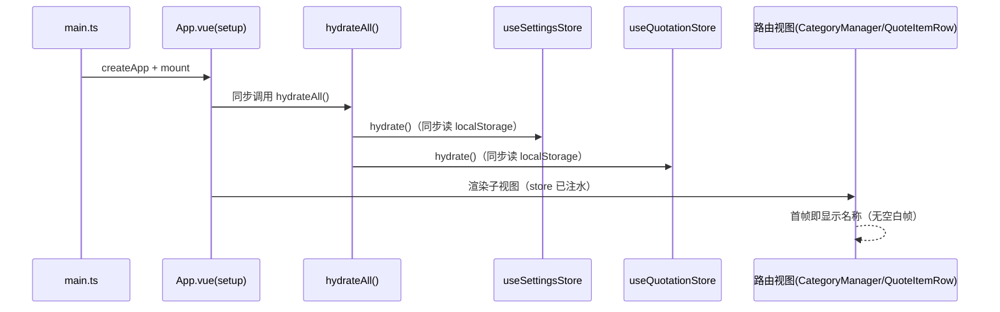
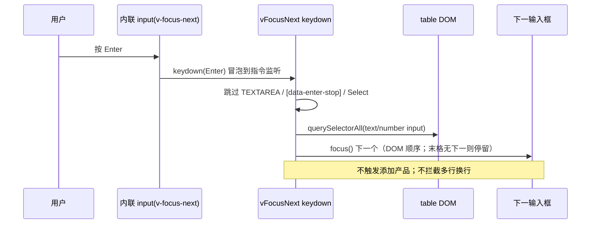
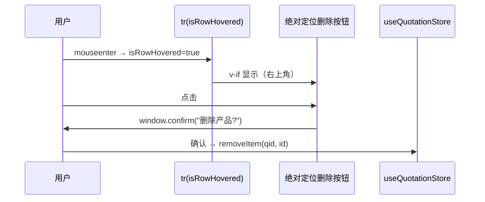
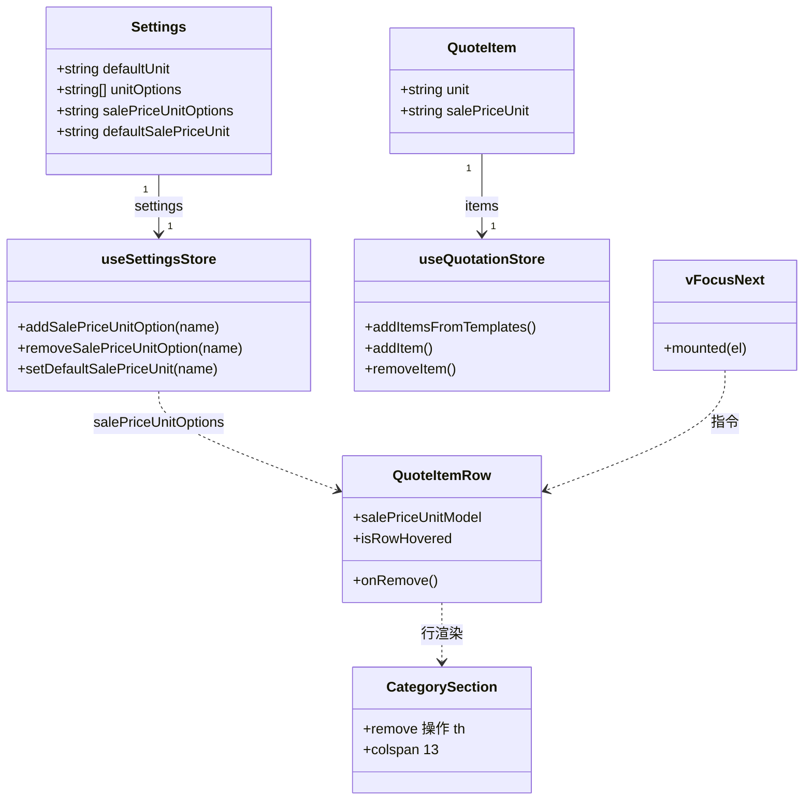
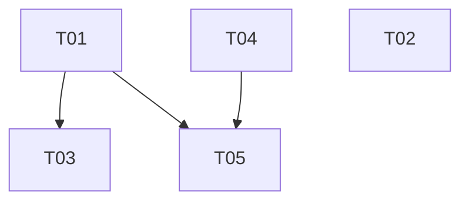

# 增量架构设计：报价工作室 UI/UX 体验优化（6 项）

- **文档版本**：v1.0
- **日期**：2026-08-24
- **架构师**：高见远（software-architect）
- **对应 PRD**：`docs/incremental-prd-ui-2026-08-24.md`
- **技术栈**：Vite 6 + Vue 3.5 + TS strict + Pinia + vue-router(hash) + Tailwind 3（coral/paper）；单文件产物 `dist-single/index.html`
- **现状确认方式**：已实际读取下列文件并标注真实行号（非推断）

---

## 1. 实现方案概述 + 框架选型

本次全部为**增量修改**，沿用现有技术栈，**不引入任何新依赖**。决策要点：

| 变更 | 方案 | 关键文件 |
|---|---|---|
| #1 进入即显示 | 将 `hydrateAll()` 从 `App.onMounted` 改为**应用启动同步执行**（在 `App` 的 `<script setup>` 顶层调用），使所有路由视图在首次挂载前 store 已注水；并核对名称字段均为响应式绑定 | `App.vue`、`CategoryManager.vue`、`QuoteItemRow.vue`、`BaseModal.vue` |
| #2 Enter 跳转 | 新增全局指令 `v-focus-next`（挂在 `main.ts`），仅作用于原生 `text`/`number` 输入，按下 Enter 在表格 DOM 顺序内聚焦下一输入框；**不挂到 `ProductDefaultsSettings` 的显式 `@keyup.enter` 输入**，且跳过 `<Select>`/多行文本 | `shared/directives/focus-next.ts`、`main.ts`、`QuoteItemRow.vue` |
| #3 售价单位 | 在 `Settings` 增 `salePriceUnitOptions`/`defaultSalePriceUnit`，`QuoteItem` 增可选 `salePriceUnit`；复用现有 `normalizeUnitInput`；报价行售价旁新增单位 `<Select>` | `settings/types.ts`、`settings/constants.ts`、`settings/store/*`、`quotation/types.ts`、`quotation/store/*`、`ProductDefaultsSettings.vue`、`QuoteItemRow.vue` |
| #4 DTO/IVA 单行 | 表头改西文 `DTO%`/`IVA%` + `whitespace-nowrap` + 适度加宽；单元格同步 `whitespace-nowrap` | `CategorySection.vue`、`QuoteItemRow.vue`、`schema/canonical.ts`(建议同步) |
| #5 左对齐 | 移除报价行数字输入的 `text-right`/`text-center`/`ml-auto`，统一 `text-left`（排除只读汇总单元格） | `QuoteItemRow.vue` |
| #6 悬停删除 | 移除 `操作` 整列（含 sticky 右列样式），`colspan` 14→13；行内复用已有 `isRowHovered` 在右上角绝对定位低调删除按钮，`window.confirm` 二次确认保留 | `CategorySection.vue`、`QuoteItemRow.vue` |

**框架/库选型结论**：无新依赖。聚焦指令用 Vue 原生 `Directive` 对象 + DOM 查询实现（约 25 行），不引入 focus-trap 类库。`normalizeUnitInput` 已在 `@/shared/util`（util.ts:36）实现，直接复用。

---

## 2. 文件改动清单（相对路径 + 具体改动 + 真实行号）

### 2.1 数据层 / 基础设施（T01）

**`src/modules/settings/types.ts`**
- L32-44 `interface Settings`：新增两字段
  - `salePriceUnitOptions: string[];` // 可选售价单位列表
  - `defaultSalePriceUnit: string;` // 新建/默认售价单位

**`src/modules/settings/constants.ts`**
- L21-37 `DEFAULT_SETTINGS`：新增
  - `salePriceUnitOptions: ['件', 'm2', 'm3', 'h', '天'],`
  - `defaultSalePriceUnit: '件',`

**`src/modules/settings/store/persistence.ts`**
- `normalizeSettings`（L43-91）：在 `rawUnitOptions`(L50) 之后新增 `rawSalePriceUnitOptions` 归一化（复用 `normalizeUnitInput`，L17 已导入）；在返回值对象（L66-89）新增 `salePriceUnitOptions` 与 `defaultSalePriceUnit`（缺省回退到 `DEFAULT_SETTINGS`）。

**`src/modules/quotation/types.ts`**
- L30-49 `interface QuoteItem`：新增可选字段
  - `salePriceUnit?: string;` // 售价单位（缺省回退 defaultSalePriceUnit → defaultUnit）

**`src/modules/quotation/store/persistence.ts`**
- `normalizeQuoteItem`（L50-69）：新增 `salePriceUnit: str(raw.salePriceUnit, 20)`（保留原值，空串允许；展示层回退）。

**`src/modules/settings/store/settings-store.ts`**
- 在「单位选项」action 区（L244-261）之后新增三个 action，镜像实现：
  - `addSalePriceUnitOption(name)`（复用 `normalizeUnitInput`，L36 已导入）
  - `removeSalePriceUnitOption(name)`
  - `setDefaultSalePriceUnit(name)`
- 在 `return {}` 导出块（L447-494）补充上述三个 action。

**`src/shared/directives/focus-next.ts`**（新增）
- 导出 `vFocusNext: Directive<HTMLElement>`，见 §7 共享约定。

**`src/main.ts`**
- L8-16：在 `app.use(createPinia()).use(router)` 之前/之后注册指令：`app.directive('focus-next', vFocusNext);`

### 2.2 #1 进入即显示（T02）

**`src/App.vue`**
- L28-30 `onMounted(() => { hydrateAll(); })` → 改为在 `<script setup>` 顶层**同步调用** `hydrateAll()`（置于 `useRoute()` 等之后、`onMounted` 之前；`onMounted` 可保留为空或删除）。理由：父组件 `setup` 先于子路由视图 `setup`/`mounted` 执行，可保证视图首次挂载时 store 已注水（见 §4 调用流程）。

**`src/modules/settings/components/CategoryManager.vue`**
- L200-205 大类名称 `<Input :value="g.name" @input=...>`：确认绑定为响应式、无 `v-if`/opacity 门控；启动 hydrate 后首帧即显示。无需改结构，仅需工程师实机确认（见 §8）。

**`src/modules/quotation/components/QuoteItemRow.vue`**
- L46 `nameModel` 计算属性 `get: () => props.item.name`：本就响应式，确认无隐患即可。

**`src/shared/components/BaseModal.vue`**
- L20-46 `<transition name="pop">` + `v-if="open"`：确认打开时内容随已注水 store 立即渲染（pop 过渡为纯 CSS 自动完成，tailwind.css L168-178）。无需改动，仅确认。

### 2.3 #3 售价单位 UI（T03）

**`src/modules/settings/components/ProductDefaultsSettings.vue`**
- 在「单位」区块之后（L97 之后）新增「售价单位」区块，结构镜像 L49-97：默认售价单位 `<Select>`（绑定 `settings.settings.defaultSalePriceUnit` / `setDefaultSalePriceUnit`）、可选列表 chips + 删除（`removeSalePriceUnitOption`）、新增输入（`addSalePriceUnitOption`，`@keyup.enter` 显式新增——**此处不挂 `v-focus-next`**）。新增本地 `ref newSalePriceUnit`。

**`src/modules/quotation/components/QuoteItemRow.vue`**
- 新增计算属性 `salePriceUnitModel`：`get: () => props.item.salePriceUnit || settings.settings.defaultSalePriceUnit || settings.settings.defaultUnit; set: (v) => update('salePriceUnit', v)`。
- L296-310 售价 `td`：在管理态内将 `number` 输入与售价单位 `<Select>`（复用 L338-354 的 unit `<Select>` 写法，选项改为 `settings.settings.salePriceUnitOptions`，`v-model="salePriceUnitModel"`）并排（flex 容器）。客户视图（L307-309）`/ {{ item.unit }}` 改为 `/ {{ salePriceUnitModel }}`。

**`src/modules/quotation/store/quotation-store.ts`**
- `addItemsFromTemplates`（L209-237）：插入对象新增 `salePriceUnit: t.defaultSalePriceUnit || settings.settings.defaultSalePriceUnit || settings.settings.defaultUnit`。
- `addItem`（L162-179）：插入对象新增 `salePriceUnit: settings.settings.defaultSalePriceUnit || settings.settings.defaultUnit`。

### 2.4 #4 + #5 表格视觉（T04）

**`src/modules/quotation/components/CategorySection.vue`**
- 表头（L137-145）：`折扣%`→`DTO%`、`税率%`→`IVA%`（L143/L144），并加 `whitespace-nowrap`；列宽 `w-16`→`w-20`（或 `w-24`）避免折行。
- 表头对齐保持 `text-right` 亦可（仅输入改左对齐，见 §8-B）；若团队要求表头与输入一致左对齐可一并改，本设计默认**仅输入左对齐**。

**`src/modules/quotation/components/QuoteItemRow.vue`**
- #5 左对齐（移除 `text-right`/`text-center`/`ml-auto`，改 `text-left`）：
  - 售价 `td` L297 `text-right`→`text-left`；输入 L304 `w-20 ml-auto text-right`→`w-20 text-left`（去 `ml-auto`、去 `text-right`）。
  - 数量 `td` L313 `text-right`→`text-left`；内部 `div` L314 `justify-end`→`justify-start`；输入 L329 `text-center`→`text-left`。
  - 进价 `td` L388 `text-right`→`text-left`；输入 L395 `text-right`→`text-left`。
  - 折扣% `td` L400 `text-right`→`text-left`；输入 L408 `text-right`→`text-left`；`td` 加 `whitespace-nowrap`。
  - 税率% `td` L413 `text-right`→`text-left`；输入 L421 `text-right`→`text-left`；`td` 加 `whitespace-nowrap`。
  - 内部备注输入 L383 本就左对齐（`w-full pr-2`），保持不变。
  - **不变**：小计 `td`(L361)、利润 `td`(L426) 为只读汇总，保留 `text-right`（非输入）。
- #4 单元格单行：折扣%/税率% 的 `td`（L400/L413）加 `whitespace-nowrap`（行内 `input` 本身单行，无需改）。

**`src/modules/quotation/schema/canonical.ts`**（建议同步，非强制）
- L50-51：`header: '折扣%'`→`'DTO%'`、`header: '税率%'`→`'IVA%'`，保持导出/PDF 与界面一致（见 §8-B）。

### 2.5 #6 悬停删除 + #2 Enter 串联（T05）

**`src/modules/quotation/components/CategorySection.vue`**
- 移除表头 `操作` `th`（L140，含 `sticky right-0 z-10` 整段）。
- colspan 计数 `isCustomer ? 8 : 14` → `isCustomer ? 8 : 13`：空态 L157、展开模板行 L165、收起添加行 L209。
- 小计行（L194-205）：原 5 个 `v-if="!isCustomer"` 空 `td`（L199-203）对应「操作/内部备注/进价/折扣%/税率%」；移除最左一个（L199，即原 操作 占位），保留 4 个。此时 `7+1+4+1=13` 列对齐。
- 注：照片展开行 `colspan`（QuoteItemRow L440）原 `isCustomer ? 7 : 13` 在移除 操作 列后恰好等于新总列数 13，顺带修正了此前 14 总列下 span=13 的错位。

**`src/modules/quotation/components/QuoteItemRow.vue`**
- 移除 `操作` `td`（L365-376 整段，含 `sticky right-0 z-10`）。
- 在行内最右可见单元格（`利润` `td`，L426-430）加 `relative` 定位上下文，内嵌绝对定位删除按钮：
  ```html
  <button v-if="isRowHovered" type="button"
    class="absolute top-1.5 right-1.5 text-paper-300 hover:text-red-600 hover:bg-red-50/70 rounded p-1 leading-none"
    title="删除" @click="onRemove">
    <span v-html="icon('trash')"></span>
  </button>
  ```
  `onRemove`（L81-85）保留 `window.confirm` 逻辑不变。`isRowHovered`（L39, L187-188）已存在并切换。
- Enter 聚焦串联：在管理态各内联原生 `<input>`（name L263、model L275、customerNote L287、salePrice L299、quantity 内 number L324、cost L389、dtoPct L401、ivaPct L414、internalNote L380）上加 `v-focus-next` 指令。**不挂到** `<Select>`（单位/售价单位）与任何 `ProductDefaultsSettings` 输入。

**`src/shared/directives/focus-next.ts`**（T01 创建，T05 消费，列此仅作引用）

---

## 3. 数据结构 / 类型变更

### 3.1 Settings（设置中心）
```ts
interface Settings {
  // …既有字段…
  defaultUnit: string;            // 数量默认单位（不变）
  unitOptions: string[];          // 数量可选单位（不变）
  salePriceUnitOptions: string[]; // 新增：售价可选单位
  defaultSalePriceUnit: string;   // 新增：售价默认单位
  // …其余不变…
}
```

### 3.2 QuoteItem（产品行）
```ts
interface QuoteItem {
  // …既有字段…
  unit: string;          // 数量单位（不变）
  salePriceUnit?: string; // 新增：售价单位（可选；空 → 展示回退）
  // …其余不变…
}
```

### 3.3 迁移 / persistence 兼容策略（无破坏）

| 场景 | 处理 |
|---|---|
| 旧 `Settings` 无 `salePriceUnitOptions` | `normalizeSettings` 回退到 `DEFAULT_SETTINGS.salePriceUnitOptions`；`defaultSalePriceUnit` 回退到 `DEFAULT_SETTINGS.defaultSalePriceUnit` |
| 旧 `QuoteItem` 无 `salePriceUnit` | `normalizeQuoteItem` 保留空串；**展示层** `salePriceUnitModel` 回退 `defaultSalePriceUnit → defaultUnit`，保证旧报价不破 |
| 新建产品行 | `addItemsFromTemplates`/`addItem` 写入 `t.defaultSalePriceUnit || defaultSalePriceUnit || defaultUnit` |
| 单位规范化 | 售价单位新增/去重复用 `normalizeUnitInput`（`@/shared/util`，util.ts:36），与数量单位同逻辑（空白/重复/trim/m²→m2） |

> 兼容性要点：**旧数据落盘无需一次性迁移脚本**，读取时由 `normalize*` 兜底，展示时由 `salePriceUnitModel` 回退，符合 PRD「不破坏现有报价」。

---

## 4. 调用流程

### 4.1 启动 hydrate（修复 #1 根因）


> 关键：父 `setup` 先于子视图 `mounted`。原实现 `App.onMounted`(L28-30) 在子视图挂载**之后**才 hydrate，导致首帧可能空白——这是 #1「进入不显示」的真实根因（假设 ①，已坐实；假设 ② 过渡动画在同步 hydrate 后亦不再相关）。

### 4.2 Enter 聚焦（#2）


### 4.3 悬停删除（#6）


### 4.4 类 / 类型关系图


---

## 5. 任务列表（有序、含依赖、按 PRD 编号）

> 共 5 个任务（≤5 硬限），均 ≥3 文件（T05 为表格组件对，已说明）。建议执行顺序：`T01 → T02 → T04 → T03 → T05`（使 `QuoteItemRow.vue` 的累计改动在 T04/T03/T05 连续完成）。

| Task | 名称 | 源文件 | 依赖 | 优先级 | PRD |
|---|---|---|---|---|---|
| **T01** | 基础设施：类型/默认值/持久化迁移/设置 actions + `v-focus-next` 指令 + `main.ts` 注册 | `settings/types.ts`、`settings/constants.ts`、`settings/store/persistence.ts`、`quotation/types.ts`、`quotation/store/persistence.ts`、`settings/store/settings-store.ts`、`shared/directives/focus-next.ts`、`main.ts` | 无 | P1 | #2(基础)、#3(数据) |
| **T02** | #1 进入即显示：启动同步 hydrate + 名称字段确认 | `App.vue`、`CategoryManager.vue`、`QuoteItemRow.vue`、`BaseModal.vue` | 无 | P0 | #1 |
| **T03** | #3 售价单位：设置页 UI + 报价行单位选择 + store 创建 | `ProductDefaultsSettings.vue`、`QuoteItemRow.vue`、`quotation/store/quotation-store.ts` | T01 | P1 | #3 |
| **T04** | #4+#5 表格视觉：DTO/IVA 单行 + 全输入框左对齐 | `CategorySection.vue`、`QuoteItemRow.vue`、`schema/canonical.ts`(建议) | 无 | P0+P1 | #4、#5 |
| **T05** | #6 悬停删除 + #2 Enter 串联：去操作列/colspan + 行内悬停删除 + 挂指令 | `CategorySection.vue`、`QuoteItemRow.vue` | T01、T04 | P1 | #6、#2 |

### 任务依赖图

说明：T02、T04 相互独立；T03 仅需 T01（数据/类型就绪）；T05 需 T01（指令）与 T04（同文件视觉改动先落地，避免冲突）。

---

## 6. 依赖包列表

**预计为空（0 个新依赖）。**

说明：本次全部改动基于既有栈（Vue 3.5 / Pinia / Tailwind 3 / 现有 `radix-vue` 风格的 `Select`/`Input` 组件）。新增的 `v-focus-next` 指令为标准 Vue `Directive` 对象，零三方依赖；单位规范化复用既有 `normalizeUnitInput`。无需修改 `package.json`。

---

## 7. 共享约定

### 7.1 `v-focus-next` 指令接口
```ts
// src/shared/directives/focus-next.ts
import type { Directive } from 'vue';

const FOCUSABLE = 'input[type="text"], input[type="number"], input:not([type]), textarea';

export const vFocusNext: Directive<HTMLElement> = {
  mounted(el: HTMLElement) {
    el.addEventListener('keydown', (e: KeyboardEvent) => {
      if (e.key !== 'Enter') return;
      const target = e.target as HTMLElement;
      if (target.tagName === 'TEXTAREA') return;          // 多行回车换行
      if (target.closest('[data-enter-stop]')) return;     // 显式 enter 动作区（预留）
      e.preventDefault();
      const root = el.closest('table') ?? document;
      const all = Array.from(root.querySelectorAll<HTMLElement>(FOCUSABLE))
        .filter((n) => n.offsetParent !== null);           // 仅可见
      const idx = all.indexOf(target);
      const next = all[idx + 1];
      if (next) next.focus();                              // 末格无下一则停留，不触发添加
    });
  },
};
```
- 注册：`app.directive('focus-next', vFocusNext)`（`main.ts`）。
- 应用范围：仅 `QuoteItemRow.vue` 管理态内联原生 `text`/`number` 输入。
- 排除：`<Select>`（单位/售价单位）、`<Button>`、多行 `textarea`、`ProductDefaultsSettings` 的 `@keyup.enter` 新增输入（不挂指令，避免破坏既有显式逻辑）。
- 末端行为（主理人已裁决）：最后一行最后一格 Enter 焦点自然落到下一行首个输入（DOM 顺序连续），**不触发「添加新产品」**。

### 7.2 单位规范化复用点
- 售价单位新增/去重统一调用 `normalizeUnitInput`（`@/shared/util`，util.ts:36），与数量单位 `addUnitOption`(settings-store.ts:245) 同逻辑；不要在组件内重复实现 trim/去重。
- 展示回退统一在 `QuoteItemRow.salePriceUnitModel` 内：`item.salePriceUnit || defaultSalePriceUnit || defaultUnit`。

### 7.3 colspan 约定
- 管理态表格总列数由 **14 → 13**（移除 操作 列）。涉及 `isCustomer ? 8 : 14` 三处（CategorySection L157/165/209）及小计行空 `td`（L199-203 删最左一个）；QuoteItemRow 待确认行 L461 同步 `14→13`。客户视图恒为 8 列，不受影响。

---

## 8. 待明确事项（需主理人拍板 / 我无法裁决）

- **A. #3 默认售价单位初始集合**：我建议 `salePriceUnitOptions: ['件','m2','m3','h','天']`、`defaultSalePriceUnit: '件'`（与数量单位语义区分）。若团队希望初始直接复用数量单位列表 `['个','米','套','件','组','m2','m3']`，请拍板。
- **B. #4 导出口径一致性**：界面表头改 `DTO%`/`IVA%` 后，`schema/canonical.ts`(L50-51) 导出/PDF 表头仍为中文 `折扣%`/`税率%`。我建议一并改为西文以保持一致；若要求导出保持中文，请拍板（则 T04 不含 canonical.ts）。
- **C. #1 真机验证**：根因已坐实为主渲染时机（父 `onMounted` 晚于子挂载），但 PRD 原「进入不显示」无截图佐证是否为同一现象。修复后建议安排 QA 在 `CategoryManager`（大类名称列表）与报价行实机回归一次；是否需要我额外补充单测请拍板。
- **D. #6 触屏替代入口**：主理人决策 #6 未要求触屏支持，但 PRD 待确认 #6 提及「无 hover 时是否提供长按/替代入口」。本期默认桌面优先（hover 才显示），若需补触屏常显/长按入口请拍板（建议本期不做，避免与低调风格冲突）。
- **E. #5 表头对齐**：仅输入改左对齐；汇总表头（售价/数量/小计/进价/折扣%/税率%/利润）保持 `text-right`。若要求表头也左对齐以完全统一，请拍板（属纯视觉微调，影响小）。

> 以上 A–E 中，A/B/E 为轻量拍板点，C/D 为验证/范围点；除 D 外均不阻塞 T01–T05 实施（A/B/E 可在对应任务内按默认值先行，待拍板后微调）。
